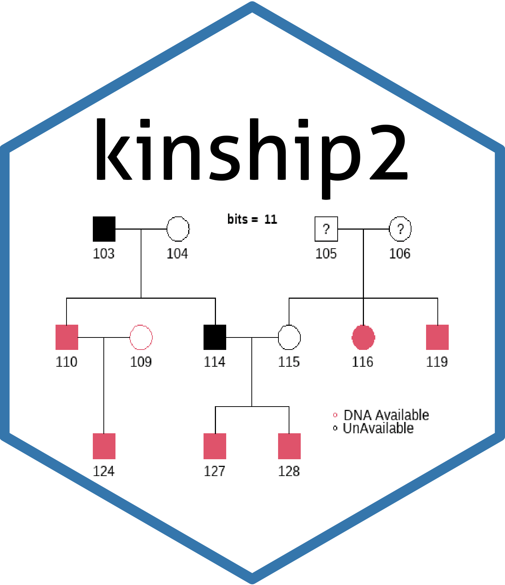

[](https://CRAN.R-project.org/package=kinship2)
[](https://CRAN.R-project.org/package=kinship2)
[](https://CRAN.R-project.org/package=kinship2)

# The `kinship2` Package 

Initially a set of functions to view pedigrees while developing models that use kinship matrices, the functions were useful enough to put into a package of its own, an S4 class for pedigrees, kinship function that calculates the kinship matrix from a pedigree object, and the pedigree plotting routines that adhere to many of the standards for genetics counselors.

## Installation

To install this package you can use the following R script:

```R
if (!require("BiocManager", quietly = TRUE))
    install.packages("BiocManager")

BiocManager::install("kinship2")
```

## Documentation

To view documentation for the version of this package installed in your system, start R and enter:

```R
browseVignettes("kinship2")
```

## News

To see the new functions / modification please use:

```R
utils::news(package="kinship2")
```

## The main functions
### The `pedigree()` Function

`pedigree()` is a function that creates an S3 class of either one pedigree of a pedigreeList (list of pedigrees), depending on whether the family id is given. The core of the pedigree object is built from having a row per person, linked by the father id and mother id. Other relationships can be specified, and affection status can be a matrix of multiple categories.

### The `plot.pedigree()` Method

`plot.pedigree()` is a method for pedigree a object that plots as a "family tree", with relatives of the same generation on the same row, and affection statuses divided over the plot symbol for each person. 


### The `kinship()` Funtion

`kinship()` is a function that creates the kinship matrix from a pedigree object. It is coded for dyplotype organisms, handling all relationships that can be specified for the pedigree object, including inbreeding, monozygotic twins, etc. A recent addition is handling the kinship matrix for the X and Y chromosomes.  

### The Shiny app

A shiny app is available with this package. It will allow you to use to import, create and visualize the pedigree data available in a given file.
To launch it just use: `pedigree_app()`.

### Other Notable Functions

* `pedigree.shrink()` will shrink a pedigree to a given size, keeping the most informative individuals for a single affection variable.

* `fix_parents()` will add parents for children who have a mother or dad listed that is not already included. It will also fix the sex status for the parent if it is mis-specified.

* legendPlot() is a variation on plot.pedigree, which has an informative legend at the bottom with the ability to put labels for the affection statuses and coloring scheme.
