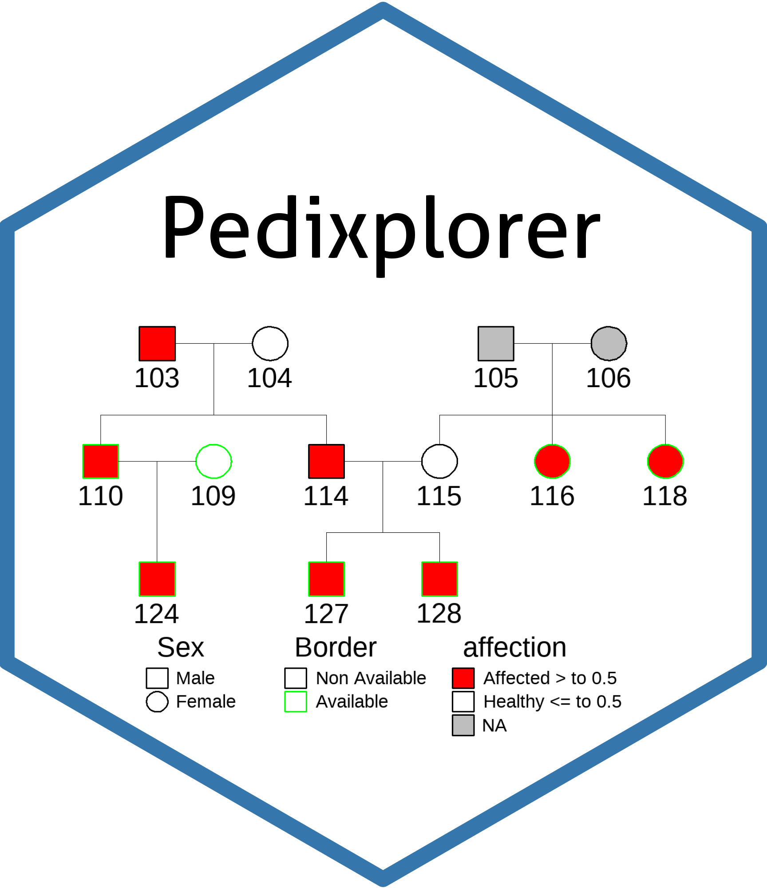
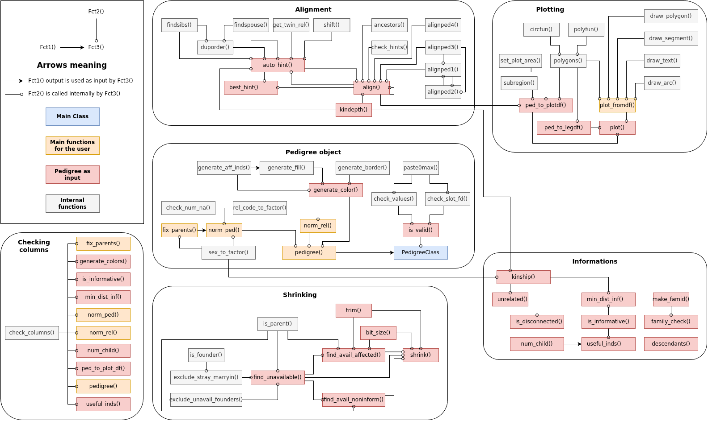
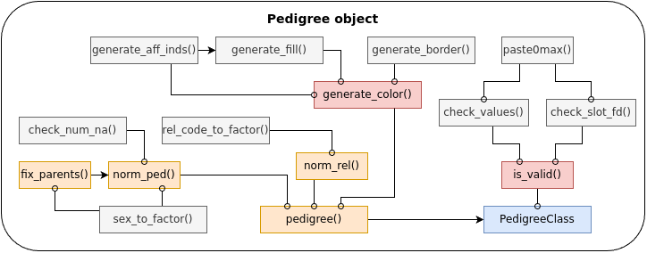
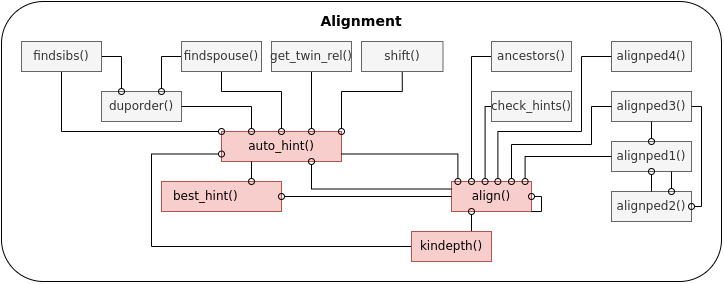
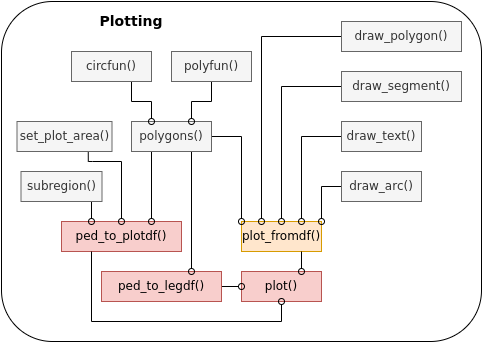
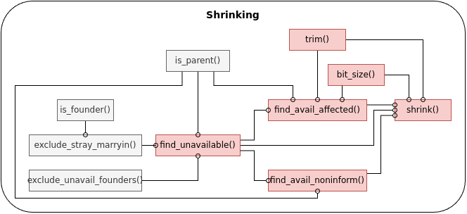
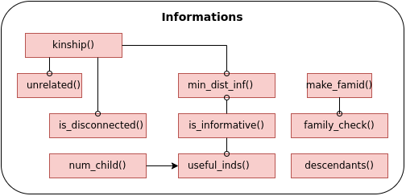
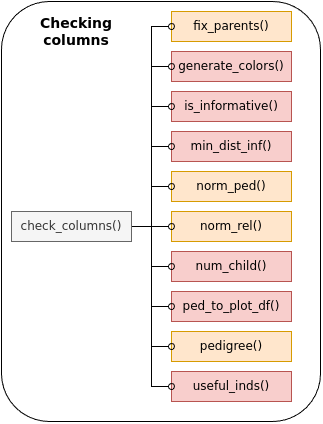
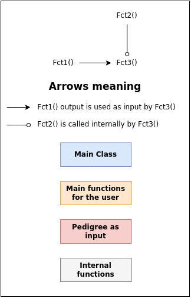

# The `Pedixplorer` Package 

[](https://CRAN.R-project.org/package=kinship2)
[](https://CRAN.R-project.org/package=kinship2)
[](https://CRAN.R-project.org/package=kinship2)

This is a fork and the new version of the [**kinship2**](https://github.com/mayoverse/kinship2) package.

Initially a set of functions to view pedigrees while developing models that use
kinship matrices, the functions were useful enough to put into a package of its
own.
It has now an S4 class for pedigrees, a kinship function that calculates the kinship
matrix from a Pedigree object, and the Pedigree plotting routines that adhere
to many of the standards for genetics counselors.

## Installation

### From Github

To install this package from Github you can use the following R script:

```R
if (!require("remotes", quietly = TRUE))
    install.packages("remotes")

remotes::install_github("louislenezet/Pedixplorer",
    build_vignettes=TRUE
)
````

### From Bioconductor (not yet available)

To install this package you can use the following R script:

```R
if (!require("BiocManager", quietly = TRUE))
    install.packages("BiocManager")

BiocManager::install("Pedixplorer")
```

## Documentation

To view documentation for the version of this package installed in your system,
start R and enter:

```R
browseVignettes("Pedixplorer")
```

## News

To see the new functions / modification please use:

```R
utils::news(package="Pedixplorer")
```

## The main functions

### The `Pedigree()` Function

`Pedigree()` is a function that creates an S4 class Pedigree object.
The core slot of the Pedigree object is the `ped` slot built from having a row
per person, linked by the father id and mother id. Other relationships can be
specified, and affection status can be a matrix of multiple categories in the
`rel` slot. All the informations about affection and availability are be stored
respectively in `scales$fill` and `scales$border` slots and are therefore used
to fill and color the border for each elements of the Pedigree graph.

### The `generate_colors()` Function

`generate_colors()` is a function that generates a color palette for an
affection status. This function is used by the `Pedigree()` function to
generate the `scales$fill` and `scales$border` slots. The user can also
use this function to generate a color palette for a specific affection
status that will be added to the Pedigree object.

### The `plot.Pedigree()` Method

`plot.Pedigree()` is a method for a Pedigree object that plots as a
"family tree", with relatives of the same generation on the same row,
and affection statuses divided over the plot symbol for each person.
This function is designed in two steps:

1. First the Pedigree object is converted into a data frame with all the
elements needed to plot the Pedigree (i.e. boxes, lines, text, etc.).
This is done by the `ped_to_plotdf()` function.
2. Then the data frame is plotted using the `plot_fromdf()` function.

### The `kinship()` Funtion

`kinship()` is a function that creates the kinship matrix from a Pedigree
object. It is coded for dyplotype organisms, handling all relationships that
can be specified for the Pedigree object, including inbreeding, monozygotic
twins, etc. A recent addition is handling the kinship matrix for the X and Y
chromosomes.

### Other Notable Functions

* `shrink()` will shrink a Pedigree to a given size, keeping the most
informative individuals for a single affection variable.

* `fix_parents()` will add parents for children who have a mother or dad listed
that is not already included. It will also fix the sex status for the parent if
it is mis-specified. This is useful to use before creating the **Pedigree**
object.

## Diagrams

The diagrams below show the main functions of the package and how they are
related.



### Details

Here is the details of the different parts of the diagram.

|       Process        |        Flow chart          |     Description      |
|:---------------------|:--------------------------:|----------------------|
| **S4 Pedixplorer creation** |  | The *Pedigree S4 object* creation is done by the **Pedigree()** constructor function. It mainly normalise a *ped_df* dataframe containing the information of each individuals with the **norm_ped()** function and the *rel_df* dataframe containing the special relationship (i.e. twins, spouse with no child) with the **norm_rel()** function. Thereafter It calls the **generate_colors()** function to create the colors scales (i.e. filling and border) before validating the object with **is_valid()** |
| **Alignment**            |      | The alignment process is used to create a **plist** stroing the graphical disposition of the different individuals and their relation between them. The *hints* information used by **auto_hint()**, **align()** can be used by the user to force the ordering of some indiviuals |
| **Plotting**             |        | The plotting process is now separated in three distinct steps: <br> - **ped_to_plotdf()** is first called to convert the *S4 Pedigree object* into a dataframe listing all the graphical elements and their caracteristic. <br> - **ped_to_legdf()** does the same but for the legend informations. <br> - **plot_fromdf()** take as input such resulting dataframe and iteratively plot the elements based on their given characteristics. <br> All those steps are merge in one step with the **plot.Pedigree()** method. |
| **Shrinking**            |      | This process is useful when you want to reduce a huge Pedigree into a more simple version. The **shrink()** method will remove iteratively the less informative individuals from the Pedigree until it reach the *max_bits* size awaited |
| **Informations**         |              | From a *S4 Pedigree object* it is possible to extract a lot of informations about the individuals, such as their shared relatedness **kinship()**, the number of direct and indirect child **num_child()**, their informativeness based on a set variable **is_informative()**, ... |
| **Checking columns**     |  | The **check_col()** function is used to check the presence absence of columns in a designated *data.frame* |
| **Legend**               |            | The diagrams listed here follow this rules |
